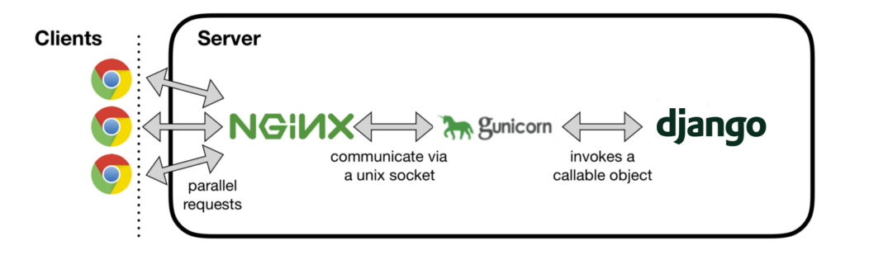
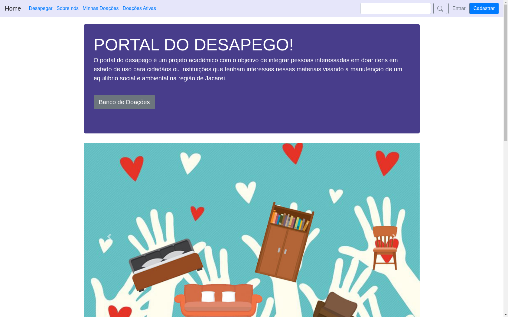

<br />

# Projeto Integrador II - Univesp - 2022
Projeto acadêmico como disciplina curricular do 5° período de 2022.

<br />

## Requisistos
O Projeto Integrador II tem como objetivo desenvolver um software com framework web utilizando
banco de dados, uso de API, recursos em javaScript, implantação em nuvem,
acessibilidade, controle de versões e testes. 

<br />

## Tema poposto
Tecnologia da informação como ferramenta de impacto
social e ambiental para facilitar o processo de doação de
itens usados em estado de utilização.

<br />

## Título
Portal de Doações - Desapego

<br />

## Descrição 
Criação de uma página na internet (website) com o objetivo de
simplificar o processo de doação de itens em estado de
utilização como: roupas, móveis, eletrônicos, entre outros.
Basicamente, conectar pessoas interessadas em doar
esses itens com pessoas que tenham interesse em
reaproveitar esses materiais visando a manutenção de um
equilíbrio social e ambiental na região proposta.

<br />

## Tecnologias utilizadas
### Arquiteturas
```
MTV - Model Template View
Implantação monolítica
```

### Desenvolvimento
```
Python
Framework Django
Banco de dados SQlite
Bootstrap
Javascript
API de authenticação Google OAuth 2.0

```
### Servers 
```
Gunicorn WSGI HTTP Server
NGINX Server
```

### Ferramentas 
```
PyCharm
Filezilla
DB Browser para SQLite
DB Designer
SSH
```

<br />

## Implantação

### Arquitetura de implantação - monolítica
<br />
<h3 align="center">
  
</h3><br />

### IaaS utilizada
```
Google Cloud Platform - GCP
Compute Engine
```
<br />

### VPS 
```
Ubuntu 20.04 LTS
VM e2-micro 2 vCPU 1GB
40 GB SSD
```
<br />

## Projeto 
<br />
<h3 align="center">
  
</h3>

## License
[MIT](https://choosealicense.com/licenses/mit/)
